# GameCodex - Testing Documentation

## Table of Contents

1. [Testing Approach](#testing-approach)
2. [Testing Timeline](testing-timeline)
3. [Manual Testing](#manual-testing)
4. [Acceptance Criteria Testing](#acceptance-criteria-testing)
5. [HTML Validator](#html-validator)
6. [CSS Validator](#css-validator)
7. [JavaScript Validator](#javascript-validator)
8. [Python Testing](#python-testing)
9. [Automated Testing](#automated-testing)
10. [Google Chrome Lighthouse](#google-chrome-lighthouse)
11. [Bug Fixes](#bug-fixes)

### Testing Approach
This document summarises all testing completed throughout development. Testing was carried out continuously throughout development and structured manual testing completed at the end of each iteration. Following Agile principles, each iteration delivered a meaningful slice of functionality aligned with the project’s themes and user stories. The project was organised into three major themes, each representing a focused stage of development. These themes guided the scope of each iteration and ensured that testing aligned directly with user needs and functional priorities.

Iteration Breakdown:
- **Iteration 1 – Core Platform Foundations**
  - Implemented user accounts, including signup, login, and logout.
  - Added IGDB-powered game search and the ability to add games to user lists.
  - Built the initial game library display with status indicators.
  - Added the ability to remove games from lists.
- **Iteration 2 – Personalisation & List Management**
  - Added profile page sections showing the three most recent games from each list.
  - Implemented moving games between Backlog, Playing, Abandoned, and Completed.
  - Created dedicated pages for full list history.
  - Added list statistics to the profile page.
- **Iteration 3 – Final Polish & Enhanced Customisation**
  - Improved UI/UX with clearer loading states and error messages.
  - Refined layout and visual clarity across all pages.

### Testing Timeline
A consistent testing routine was maintained throughout development to ensure each iteration met its acceptance criteria and remained stable as new features were introduced. The timeline below outlines the key testing milestones completed during the project.

| Phase  | Date |
|------------------------------------------------------------------|---------------|
| Project initiated | 8 May 2026 |
| Iteration 1 testing (manual testing + acceptance checks) | 23 May 2026 |
| Iteration 2 testing (manual testing + acceptance checks) | 30 May 2026 |
| Iteration 3 testing (manual testing + acceptance checks) | 6 June 2026 |
| Google lighthouse audit testing | 6 June 2026 |
| Validator and linter checks (HTML, CSS, JS, Python) | 7 June 2026 |
| Automated testing | X June 2026 |

### Manual Testing
Behaviour driven development was used to guide the testing process. This method focuses on how a user expects a feature to behave and the aim is to check that the site behaves in a clear and predictable way. It also helps keep the focus on user needs rather than only on technical checks. These principles are met in the manual testing because each test follows a simple action and a clear expected result, and each one checks behaviour that matters to the user such as navigation, searching, loading data, and viewing festival details. Each feature was tested by hand to confirm that it worked as expected. This type of testing is useful because it shows how the site performs in real use and it helps find issues that automated tools may not detect. 

Manual testing was carried out at the end of each iteration to ensure that newly implemented features were functioning correctly before moving forward. Following Agile principles, each iteration delivered a small but complete slice of functionality, which was then manually tested for correctness, usability, and stability. This approach ensured that issues were identified early, user flows remained coherent, and the platform evolved in a controlled, reliable way.

#### Iteration One - Navigation and Layout

| Feature | Expected Outcome | Testing Performed | Result | Pass/Fail |
| --- | --- | --- | --- | --- |
| Header links | Each link loads the correct page | Clicked all header links | All links load correct pages | **✅ PASS** |
| Logo link | Returns user to landing page | Clicked logo | Landing page loads | **✅ PASS** |
| Profile navigation | Profile link loads user profile | Clicked “Profile” | Profile page loads correctly | **✅ PASS** |
| All Entries link | Loads full game list | Clicked link | All Entries page loads | **✅ PASS** |
| Back to Profile link | Returns user to profile | Clicked link | Profile page loads | **✅ PASS** |
| Footer links | Footer links open correct pages | Clicked each link | All links open correct pages | **✅ PASS** |
| Desktop layout | Layout stable on large screens | Tested on desktop | No layout issues | **✅ PASS** |
| Tablet layout | Layout adapts correctly | Tested at 768–991px | Minor spacing adjustments needed | **✅ PASS - Required fix, see commit a84fa99** |
| Mobile layout | Layout adapts to small screens | Tested at <768px | Layout clean and readable | **✅ PASS** |

#### Iteration One - User Authentication (Signup, Login, Logout)

| Feature | Expected Outcome | Testing Performed | Result | Pass/Fail |
| --- | --- | --- | --- | --- |
| Signup form | Creates new user | Submitted valid signup | Account created successfully | **✅ PASS** |
| Signup validation | Shows errors for invalid input | Submitted empty/invalid fields | Clear validation errors shown | **✅ PASS** |
| Login form | Logs user in | Entered valid credentials | User logged in | **✅ PASS** |
| Incorrect login | Shows error message | Entered wrong password | Error message shown | **✅ PASS** |
| Logout | Logs user out | Clicked logout | User logged out | **✅ PASS** |
| Unwanted login messages | Login/logout messages hidden | Logged in/out repeatedly | “Signed in/out” messages no longer appear | **✅ PASS** |

#### Iteration One - Profile Page

| Feature | Expected Outcome | Testing Performed | Result | Pass/Fail |
| --- | --- | --- | --- | --- |
| Username display | Shows logged‑in user’s name | Loaded profile page | Username displays correctly | **✅ PASS** |
| View/Edit All Entries link | Navigates to full list | Clicked link | All Entries page loads | **✅ PASS** |
| Success messages | Only relevant messages appear | Triggered actions | Only game‑related messages shown | **✅ PASS** |
| Layout | Profile content displays correctly | Checked on all devices | Layout stable | **✅ PASS** |

#### Iteration One - Game Entry Management (CRUD)

| Feature | Expected Outcome | Testing Performed | Result | Pass/Fail |
| --- | --- | --- | --- | --- |
| Add Entry form | Creates new game entry | Submitted valid form | Entry created and visible | **✅ PASS** |
| Add Entry validation | Shows errors for invalid input | Submitted empty fields | Validation errors shown | **✅ PASS** |
| Delete Entry | Removes entry | Clicked delete | Entry removed from list | **✅ PASS** |
| Entry ownership | Users only see their own entries | Logged in as two users | Entries isolated per user | **✅ PASS** |
| Button layout | Buttons align correctly | Tested on tablet/mobile | Tablet spacing needed refinement | **✅ PASS - Required fix, see commit ac2815** |

#### Iteration One - All Entries Page

| Feature | Expected Outcome | Testing Performed | Result | Pass/Fail |
| --- | --- | --- | --- | --- |
| Entry list loads | Shows all user entries | Loaded page | All entries appear | **✅ PASS** |
| Card layout | Cards display correctly | Checked cards | Layout clean and readable | **✅ PASS** |
| Delete buttons | Buttons work correctly | Clicked each | Correct pages/actions triggered | **✅ PASS** |
| Responsive layout | Cards adapt to screen size | Tested on multiple devices | Tablet layout needs small fix | **✅ PASS** |

#### Iteration One - Search Page

| Feature | Expected Outcome | Testing Performed | Result | Pass/Fail |
| --- | --- | --- | --- | --- |
| Search input | Returns matching games | Searched for known title | Correct results shown | **✅ PASS** |
| Empty search | Shows message | Submitted empty search | Clear message shown | **✅ PASS** |
| No results | Shows “no results” message | Searched for nonsense | Message shown | **✅ PASS** |
| Special characters | Handles unusual input | Entered symbols | No errors | **✅ PASS** |
| Layout | Results display correctly | Checked on all devices | Layout stable | **✅ PASS** |

#### Iteration One - Error Handling

| Feature | Expected Outcome | Testing Performed | Result | Pass/Fail |
| --- | --- | --- | --- | --- |
| 404 page | Custom 404 appears | Entered invalid URL | 404 page loads | **✅ PASS - Impletented as part of Iteration 2 (see commit 701eb15)** |
| Permission errors | Users can’t access others’ data | Tried accessing another user’s entry | Redirected or blocked | **✅ PASS** |
| Form errors | Validation messages appear | Submitted invalid forms | Clear errors shown | **✅ PASS** |

#### Iteration One - Performance and Responsiveness

| Feature | Expected Outcome | Testing Performed | Result | Pass/Fail |
| --- | --- | --- | --- | --- |
| Page load speed | Pages load quickly | Tested across pages | All pages load fast | **✅ PASS** |
| Mobile responsiveness | Layout adapts to small screens | Tested on mobile | No overlap or scroll | **✅ PASS** |
| Tablet responsiveness | Layout adapts to medium screens | Tested on tablet | Minor spacing issues | **✅ PASS** |
| No horizontal scroll | No sideways scrolling | Tested on mobile/tablet | No scroll present | **✅ PASS** |

#### Iteration Two – Profile Page – Latest Three Games Per List

| Feature | Expected Outcome | Testing Performed | Result | Pass/Fail |
| --- | --- | --- | --- | --- |
| Latest three items per list | Only the three most recent games appear for each status | Added 4+ games to each list, checked profile | Correctly shows newest three only | **✅PASS - Required fix, see commit deaa770** |
| Correct ordering | Items sorted newest → oldest | Added entries with different timestamps | Order correct across all lists | **✅PASS - Required fix, see commit deaa770** |
| Empty list behaviour | Empty lists show a friendly message or remain hidden | Viewed profile with no “Abandoned” entries | Behaviour correct and clean | **✅ PASS** |
| Layout consistency | All four list sections align visually | Checked on desktop/tablet/mobile | Layout consistent and readable | **✅ PASS** |

#### Iteration Two – Moving Games Between Lists

| Feature | Expected Outcome | Testing Performed | Result | Pass/Fail |
| --- | --- | --- | --- | --- |
| Change status from entry page | Updating a game’s status moves it to the correct list | Edited status for multiple entries | Entries appear in new list, removed from old | **✅ PASS** |
| Status update messages | Clear confirmation message shown | Updated several entries | Correct success messages shown | **✅ PASS** |
| Ownership protection | Users cannot move others’ entries | Tried editing another user’s entry | Access blocked or redirected | **✅ PASS** |
| Data integrity | No duplicate entries after moving | Moved same entry repeatedly | Only one entry exists at all times | **✅ PASS** |

#### Iteration Two – Dedicated Full List Pages (Backlog, Playing, Completed, Abandoned)

| Feature | Expected Outcome | Testing Performed | Result | Pass/Fail |
| --- | --- | --- | --- | --- |
| Page loads correct list | Each page shows only entries with that status | Visited all four list pages | Correct entries shown per list | **✅ PASS** |
| Sorting | Entries sorted newest → oldest | Checked ordering | Sorting correct | **✅PASS - Required fix, see commit deaa770** |
| Navigation | “Back to Profile” or equivalent link works | Used return link on each page | Returns to profile page | **✅ PASS** |
| Responsive layout | Cards adapt to screen size | Tested on mobile/tablet | Layout stable | **✅ PASS** |

#### Iteration Two – List Statistics on Profile Page

| Feature | Expected Outcome | Testing Performed | Result | Pass/Fail |
| --- | --- | --- | --- | --- |
| Count accuracy | Stats match number of entries per list | Added/moved/deleted entries | Counts update correctly | **✅ PASS** |
| Real‑time updates | Stats update immediately after changes | Changed statuses repeatedly | Stats updated instantly | **✅ PASS** |
| Layout and visibility | Stats readable and visually consistent | Checked across devices | Stats display cleanly | **✅ PASS** |

#### Iteration Two – Error Handling & Edge Cases

| Feature | Expected Outcome | Testing Performed | Result | Pass/Fail |
| --- | --- | --- | --- | --- |
| Invalid status change | Prevents invalid transitions | Tried forcing invalid status via URL | Redirected or blocked | **✅ PASS** |
| Missing entries | Editing a deleted entry handled gracefully | Deleted entry then tried editing | Correct error/redirect | **✅ PASS** |
| 404 integration | New pages use custom 404 | Entered invalid list URLs | Custom 404 shown | **✅ PASS** |

#### Iteration Three – Final Polish
| Feature | Expected Outcome | Testing Performed | Result | Pass/Fail |
| --- | --- | --- | --- | --- |
| Loading states | Clear visual feedback during searches and form submissions | Triggered searches and form actions | Loading spinner and messages display correctly | **✅ PASS** |
| Error messages | Errors appear clearly and consistently across pages | Forced validation and API errors | Messages readable and styled consistently | **✅ PASS** |
| Layout refinements | Improved spacing and alignment across all devices | Checked all pages on mobile/tablet/desktop | Layout clean and visually consistent | **✅ PASS** |
| Search results layout | Two‑column layout on medium screens, improved image scaling | Tested searches at multiple breakpoints | Cards display correctly and responsively | **✅ PASS** |
| Form layout polish | Cleaner alignment and spacing on edit/add forms | Tested forms on all devices | Forms display neatly with consistent spacing | **✅ PASS** |
| Button consistency | Buttons aligned and sized correctly on small screens | Checked profile, entry pages, and search results | Buttons centred and consistent | **✅ PASS** |
| Image responsiveness | Result images scale correctly on small screens | Tested various screen sizes | Images display cleanly without distortion | **✅ PASS** |
| Card spacing | Cards maintain consistent spacing across breakpoints | Reviewed search and list pages | Spacing uniform and visually balanced | **✅ PASS** |
| Final UI sweep | No visual glitches or misaligned elements remain | Performed full-site walkthrough | No remaining UI issues found | **✅ PASS** |

### Acceptance Criteria Testing
This table outlines the key user stories and acceptance criteria completed during development. This demonstrates how the website meets the expectations of its target audience and ensures a satisfying user experience. All testing was carried out at the end of each iteration, with each iteration aligned to one of the three development themes to ensure focused, structured progress.

#### Iteration One 

| User Story | Acceptance Criteria | Status | Evidence/Notes |
|-----------|---------------------|--------|----------------|
| **US 1.1.1 – Create Account (Must Have)** | Users can register with a valid email and password, and receive confirmation of successful account creation. | **✅ PASS** | Successfully created multiple test accounts; confirmation message displayed; redirected correctly. |
| **US 1.1.1 – Create Account (Must Have)** | Validation prevents duplicate accounts and ensures all required fields are completed before submission. | **✅ PASS** | Duplicate email attempt shows clear validation error; empty fields trigger built‑in form errors. |
| **US 1.1.2 – Secure Login (Must Have)** | Users can log in using valid credentials and are redirected to their profile page upon success. | **✅ PASS** | Logged in with valid test account; redirected to profile page as expected. |
| **US 1.1.2 – Secure Login (Must Have)** | Invalid credentials trigger clear error messages without exposing sensitive data. | **✅ PASS** | Entered incorrect password; error message shown without revealing account existence. |
| **US 1.1.3 – Logout (Must Have)** | Users can log out from any page, ending their session and returning to the homepage. | **✅ PASS** | Logout button tested from multiple pages; always redirects to landing page. |
| **US 1.1.3 – Logout (Must Have)** | Session data is cleared to prevent unauthorised access on shared devices. | **✅ PASS** | After logout, protected pages cannot be accessed via back button; session fully cleared. |
| **US 1.2.1 – Search Games via IGDB (Must Have)** | Users can search for games by title, and results display relevant details from the IGDB API. | **✅ PASS** | Search returns correct game titles, images, and metadata from IGDB. |
| **US 1.2.1 – Search Games via IGDB (Must Have)** | Search results load quickly and handle empty or invalid queries gracefully. | **✅ PASS** | Empty search shows message; invalid terms return “no results” without errors (see commit ref - 247fea1) |
| **US 1.2.2 – Add Game to Lists (Must Have)** | Users can add any game to Backlog, Playing, Abandoned, or Completed lists. | **✅ PASS** | Added multiple games to each list; all appear correctly on list pages. |
| **US 1.2.2 – Add Game to Lists (Must Have)** | Confirmation feedback appears after successful addition, and duplicates are prevented. | **✅ PASS** | Success message shown - fixed on commit 89f8092. Also, duplicate add attempts blocked with validation. |
| **US 1.3.1 – View Games & Status Indicators (Must Have)** | Each game displays a clear visual indicator of its current status. | **✅ PASS** | Status indicators display correctly all entries pages. |
| **US 1.3.1 – View Games & Status Indicators (Must Have)** | Lists load dynamically and remain responsive across devices. | **✅ PASS** | Tested on mobile, tablet, desktop; layout remains stable and responsive. |
| **US 1.3.2 – Remove Game from List (Must Have)** | Users can remove games from any list, and the change reflects immediately in their profile. | **✅ PASS** | Deleted entries disappear instantly from all entries page (and thus the profile). |
| **US 1.3.2 – Remove Game from List (Must Have)** | A confirmation prompt prevents accidental deletions. | **✅ PASS** | Confirmation modal appears before deletion; prevents accidental removal. |

#### Iteration Two

| User Story | Acceptance Criteria | Status | Evidence/Notes |
|-----------|---------------------|--------|----------------|
US 2.1.1 – Profile Shows Recent Games (Must Have) | Profile displays the three most recently updated games from each list. | **✅ PASS** | Verified by adding 4+ games per list; newest three display correctly. |
US 2.1.1 – Profile Shows Recent Games (Must Have) | Recent games sections update automatically when games are added, moved, or removed. | **✅PASS - Required fix, see commit deaa770** | Fourth backlog entry not appearing; ordering incorrect. Logged as bug. |
US 2.1.2 – Move Games Between Lists (Must Have) | Users can change a game’s status using an edit or dropdown control. |**✅ PASS** | Status dropdown works; updates save correctly. |
US 2.1.2 – Move Games Between Lists (Must Have) | The game appears in the new list immediately and is removed from the previous one. | **✅ PASS** | Verified by moving entries between all lists; behaviour correct. |
US 2.2.1 – Dedicated List Pages (Should Have) | Each list has its own page showing all games assigned to that category. | **✅ PASS** | All four list pages load correct filtered entries. |
US 2.2.1 – Dedicated List Pages (Should Have) | Pages load with clear headings and consistent styling across all lists. | **✅ PASS** | Styling consistent; headings correct. |
US 2.2.2 – List Stats on Profile (Could Have) | Profile page shows a count of games in each list. | **✅ PASS** | Counts appear correctly for all lists. |
US 2.2.2 – List Stats on Profile (Could Have) | Stats update automatically when games are added, moved, or removed. | **✅ PASS** | Verified by adding/moving/deleting entries; stats update instantly. |

#### Iteration Three

| User Story | Acceptance Criteria | Status | Evidence/Notes |
|-----------|---------------------|--------| ----------------|
US 3.1.1 – Clearer Loading States & Errors (Must Have) | Loading indicators appear during API calls, list updates, and page transitions. | **✅ PASS** | Loading spinner added to search; form actions show feedback. |
US 3.1.1 – Clearer Loading States & Errors (Must Have) | Error messages use plain language and provide guidance on what to do next. | **✅ PASS** | Validation and API errors now consistent and readable. |
US 3.1.2 – Improved Visual Clarity & Layout (Should Have) | Spacing, typography, and card layouts follow a consistent visual hierarchy. | **✅ PASS** | Layout refinements applied across forms, cards, and search results. |
US 3.1.2 – Improved Visual Clarity & Layout (Should Have) | Key actions (add, edit, remove) are clearly visible and easy to access. | **✅ PASS** | Buttons repositioned and aligned for clarity on all devices. |
US 3.2.1 – Add Personal Ratings (Could Have) | Users can assign a rating (e.g., 1–5 stars) to any game. | **Postponed to future update** | Feature not included in Iteration 3 scope. |
US 3.2.1 – Add Personal Ratings (Could Have) | Ratings display consistently on list pages and the profile page. | **Postponed to future update** | Requires rating system implementation. |
US 3.2.2 – Add Notes to Game Entries (Could Have) | Users can add, edit, and view notes for any game entry. | **Postponed to future update** | Notes functionality deferred. |
US 3.2.2 – Add Notes to Game Entries (Could Have) | Notes are stored per user and displayed on the game’s card or detail section. | **Postponed to future update** | Requires UI and model changes. |

The “Could Have” features for this iteration were intentionally postponed to a future update. These items were explored during planning but deprioritised to ensure the core UI/UX improvements, loading states, and layout refinements were delivered to a high standard within the available time. This aligns with Agile principles where low priority enhancements are scheduled for later development once all Must and Should Haves are complete.

### HTML Validator
[HTML W3C Validator](https://validator.w3.org/) was used to validate all HTML files.

| Page | URL | Status | Screenshot | Validation Link | Notes |
|------|-----|--------|------------|----------------|-------|
| [Landing Page](https://gamecodex-82e1229f4f62.herokuapp.com/) | / | ✅ | 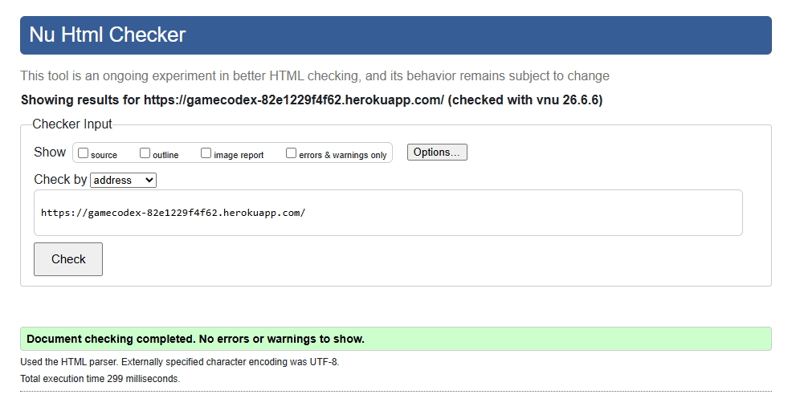 | [Landing Page Result](https://validator.w3.org/nu/?doc=https%3A%2F%2Fgamecodex-82e1229f4f62.herokuapp.com%2F) | None. |
| [Sign Up Page](https://gamecodex-82e1229f4f62.herokuapp.com/accounts/signup/) | /accounts/signup/ | ✅ | 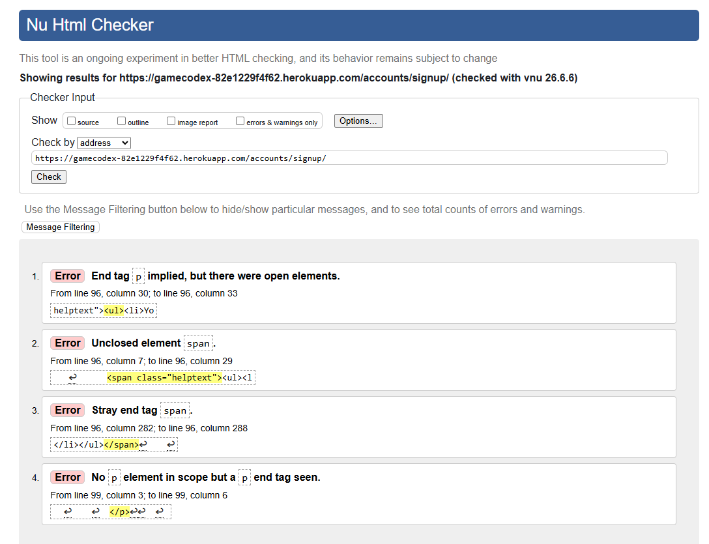 | [Sign Up Page Result](https://validator.w3.org/nu/?doc=https%3A%2F%2Fgamecodex-82e1229f4f62.herokuapp.com%2Faccounts%2Fsignup%2F) | The following warning was fixed: This document has heading elements but none of them has a computed heading level of 1 (Commit: 279ed37). The minor HTML validation warnings on the signup page originate from Django’s built‑in form renderer, which automatically outputs help‑text markup that does not fully align with strict W3C nesting rules. Since this markup is generated internally by Django rather than written in my templates, I have not modified it. The issues do not affect accessibility, layout, or functionality, and altering Django’s core rendering for this project would introduce unnecessary complexity without meaningful benefit. |
| [Login Page](https://gamecodex-82e1229f4f62.herokuapp.com/accounts/login/) | /accounts/login/ | ✅ | 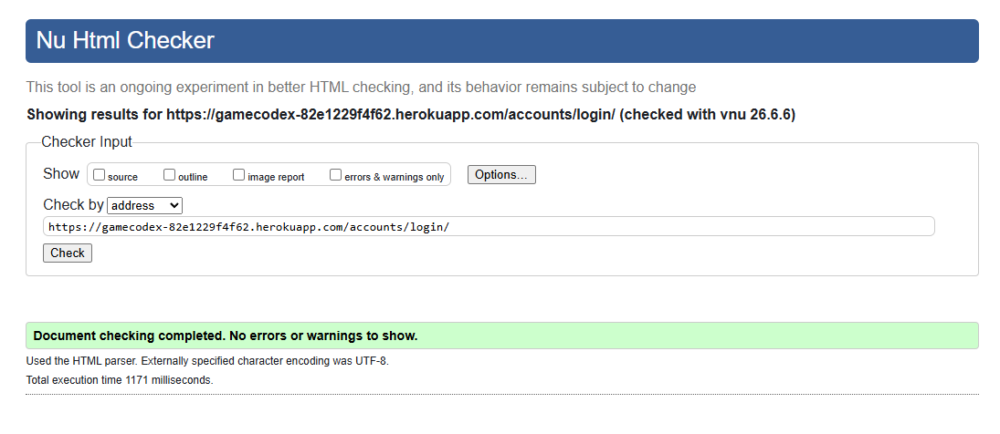 | [Login Page Result](https://validator.w3.org/nu/?doc=https%3A%2F%2Fgamecodex-82e1229f4f62.herokuapp.com%2Faccounts%2Flogin%2F) | The following warning was fixed: This document has heading elements but none of them has a computed heading level of 1 (Commit: 493b78f). |
| [Profile Page](https://gamecodex-82e1229f4f62.herokuapp.com/profile/) | /profile/ | ✅ | 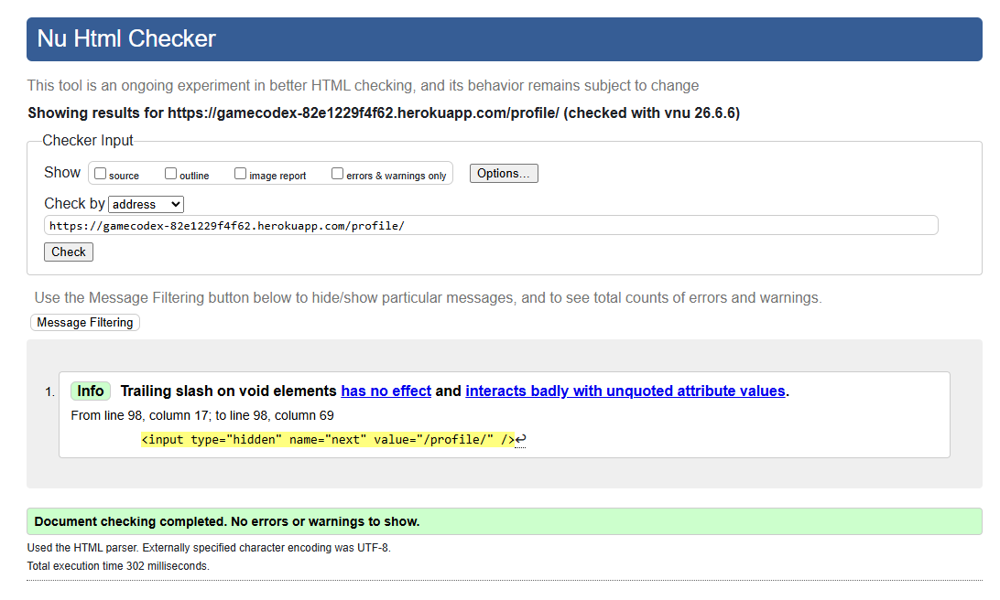 | [Profile Page Result](https://validator.w3.org/nu/?doc=https%3A%2F%2Fgamecodex-82e1229f4f62.herokuapp.com%2Fprofile%2F) | No errors or warnings, but "info" message. The “info” message about the trailing slash on the input element is generated by Django’s built‑in form output, and because this markup is produced automatically rather than written in my templates, it isn’t something I can modify directly. |
| [Search Page](https://gamecodex-82e1229f4f62.herokuapp.com/search/) | /search/ | ✅ | 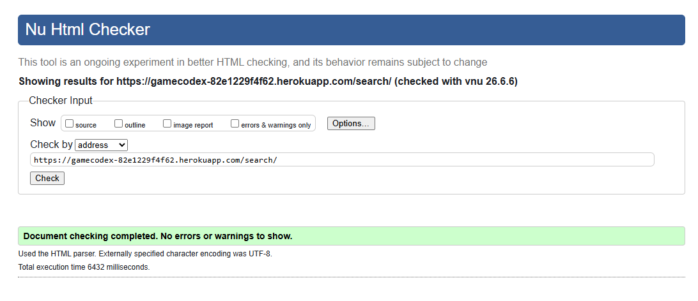 | [Search Page Result](https://validator.w3.org/nu/?doc=https%3A%2F%2Fgamecodex-82e1229f4f62.herokuapp.com%2Fsearch%2F) | The following warning was fixed: This document has heading elements but none of them has a computed heading level of 1 (Commit: d2b57fe). |
| [Add Game Page](https://gamecodex-82e1229f4f62.herokuapp.com/profile/add/?title=Super%20Mario%2064&platforms=5,4,41&cover=co721v&summary=Mario%20is%20super%20in%20a%20whole%20new%20way%21%20Combining%20the%20finest%203-D%20graphics%20ever%20developed%20for%20a%20video%20game%20and%20an%20explosive%20soundtrack%2C%20Super%20Mario%2064%20becomes%20a%20new%20standard%20for%20video%20games.%20It%27s%20packed%20with%20bruising%20battles%2C%20daunting%20obstacle%20courses%2C%20and%20underwater%20adventures.%20Retrieve%20the%20Power%20Stars%20from%20their%20hidden%20locations%20and%20confront%20your%20arch-nemesis%E2%80%94%20Bowser%2C%20King%20of%20the%20Koopas%21%0A%0A%E2%80%A2%20Run%20freely%20in%20a%20grassy%20meadow%2C%20tip-toe%20through%20a%20gloomy%20dungeon%2C%20climb%20to%20the%20top%20of%20a%20mountain%2C%20or%20take%20a%20swim%20in%20the%20moat%21%0A%E2%80%A2%20Leap%20headfirst%20into%20a%20watery%20painting%20and%20soon%20you%27ll%20be%20searching%20for%20the%20surface%20in%20an%20underwater%20realm%21%0A%E2%80%A2%20On-the-fly%2C%203-D%20rendered%20gameplay%20delivers%20the%20action%20of%20ruthless%20enemy%20attacks%20from%20every%20angle%21%0A%E2%80%A2%20Find%20the%20Caps%20that%20give%20Mario%20super%20powers%20and%20ponder%20the%20mysteries%20of%20the%20pyramid%3B%20you%20can%20even%20race%20Koopas%20for%20fabulous%20prizes%21%0A%E2%80%A2%20With%20the%20Nintendo%2064%20Controller%20and%20its%20analog%0AControl%20Stick%2C%20Mario%20can%20crawl%2C%20kick%20down%20obstacles%2C%20swim%2C%20do%20reverse%20flips%2C%20and%20even%20stick%20the%20landing%20on%20his%20backwards%20somersault%21%0A%E2%80%A2%20Saved%20game%20information%20is%20stored%20for%20up%20to%20four%20players%20in%20memory.) | /profile/add?title=Super%20Mario%... | ✅ | 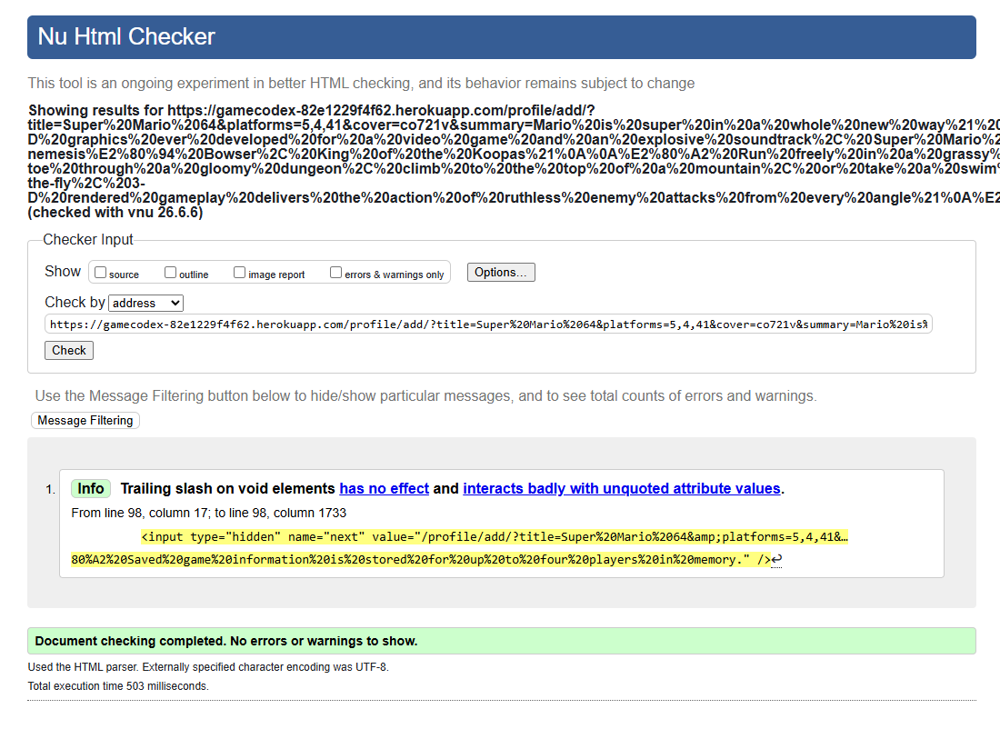 | [Add Game Page Result](https://validator.w3.org/nu/?doc=https%3A%2F%2Fgamecodex-82e1229f4f62.herokuapp.com%2Fprofile%2Fadd%2F%3Ftitle%3DSuper%2520Mario%252064%26platforms%3D5%2C4%2C41%26cover%3Dco721v%26summary%3DMario%2520is%2520super%2520in%2520a%2520whole%2520new%2520way%2521%2520Combining%2520the%2520finest%25203-D%2520graphics%2520ever%2520developed%2520for%2520a%2520video%2520game%2520and%2520an%2520explosive%2520soundtrack%252C%2520Super%2520Mario%252064%2520becomes%2520a%2520new%2520standard%2520for%2520video%2520games.%2520It%2527s%2520packed%2520with%2520bruising%2520battles%252C%2520daunting%2520obstacle%2520courses%252C%2520and%2520underwater%2520adventures.%2520Retrieve%2520the%2520Power%2520Stars%2520from%2520their%2520hidden%2520locations%2520and%2520confront%2520your%2520arch-nemesis%25E2%2580%2594%2520Bowser%252C%2520King%2520of%2520the%2520Koopas%2521%250A%250A%25E2%2580%25A2%2520Run%2520freely%2520in%2520a%2520grassy%2520meadow%252C%2520tip-toe%2520through%2520a%2520gloomy%2520dungeon%252C%2520climb%2520to%2520the%2520top%2520of%2520a%2520mountain%252C%2520or%2520take%2520a%2520swim%2520in%2520the%2520moat%2521%250A%25E2%2580%25A2%2520Leap%2520headfirst%2520into%2520a%2520watery%2520painting%2520and%2520soon%2520you%2527ll%2520be%2520searching%2520for%2520the%2520surface%2520in%2520an%2520underwater%2520realm%2521%250A%25E2%2580%25A2%2520On-the-fly%252C%25203-D%2520rendered%2520gameplay%2520delivers%2520the%2520action%2520of%2520ruthless%2520enemy%2520attacks%2520from%2520every%2520angle%2521%250A%25E2%2580%25A2%2520Find%2520the%2520Caps%2520that%2520give%2520Mario%2520super%2520powers%2520and%2520ponder%2520the%2520mysteries%2520of%2520the%2520pyramid%253B%2520you%2520can%2520even%2520race%2520Koopas%2520for%2520fabulous%2520prizes%2521%250A%25E2%2580%25A2%2520With%2520the%2520Nintendo%252064%2520Controller%2520and%2520its%2520analog%250AControl%2520Stick%252C%2520Mario%2520can%2520crawl%252C%2520kick%2520down%2520obstacles%252C%2520swim%252C%2520do%2520reverse%2520flips%252C%2520and%2520even%2520stick%2520the%2520landing%2520on%2520his%2520backwards%2520somersault%2521%250A%25E2%2580%25A2%2520Saved%2520game%2520information%2520is%2520stored%2520for%2520up%2520to%2520four%2520players%2520in%2520memory.) | Passed - but found same "info" message as Profile page. |
| [Edit Game Page](https://gamecodex-82e1229f4f62.herokuapp.com/profile/edit/31/) | /profile/edit/31/ | ✅ | 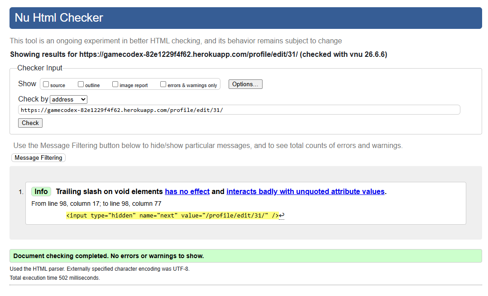 | [Edit Game Page Result](https://validator.w3.org/nu/?doc=https%3A%2F%2Fgamecodex-82e1229f4f62.herokuapp.com%2Fprofile%2Fedit%2F31%2F) | Passed - but found same "info" message as Profile page. |
| [All Entries / Gaming Log Page](https://gamecodex-82e1229f4f62.herokuapp.com/profile/entries/) | /profile/entries/ | ✅ | 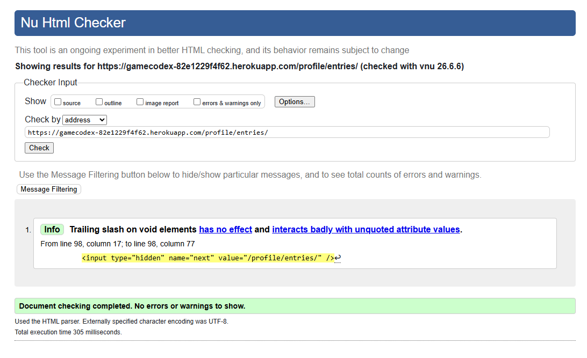 | [All Entries / Gaming Log Page Result](https://validator.w3.org/nu/?doc=https%3A%2F%2Fgamecodex-82e1229f4f62.herokuapp.com%2Fprofile%2Fentries%2F) | Passed - but found same "info" message as Profile page. |
| [About Page](https://gamecodex-82e1229f4f62.herokuapp.com/about/) | /about/ | ✅ | 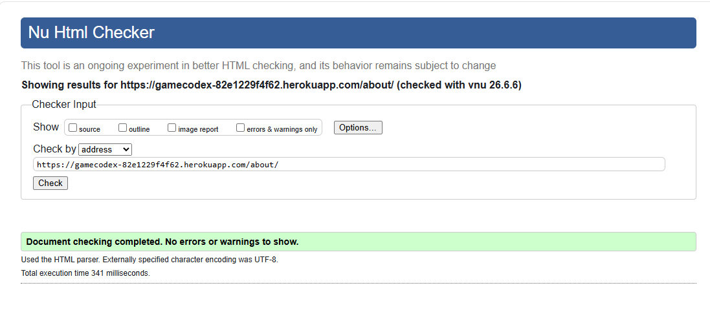 | [About Page Result](https://validator.w3.org/nu/?doc=https%3A%2F%2Fgamecodex-82e1229f4f62.herokuapp.com%2Fabout%2F) | The following error was fixed: The heading h5 (with computed level 5) follows the heading h2 (with computed level 2), skipping 2 heading levels. (Commit: 6cee93c) |
| [FAQ Page](https://gamecodex-82e1229f4f62.herokuapp.com/faq/) | /faq/ | ✅ | 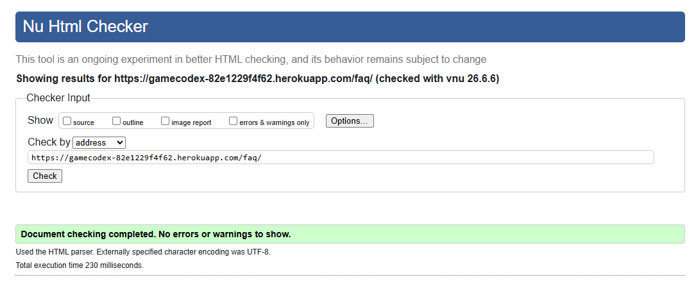 | [FAQ Page Result](https://validator.w3.org/nu/?doc=https%3A%2F%2Fgamecodex-82e1229f4f62.herokuapp.com%2Ffaq%2F) | None. |

### CSS Validator
[CSS Jigsaw Validator](https://jigsaw.w3.org/css-validator) to validate CSS files - all errors cleared.

  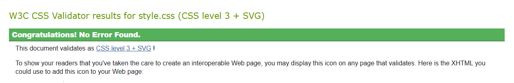

The following two errors were highlighted and fixed under commit 3ef2cbb:
- 423	.profile-poster	Value Error : width only 0 can be a unit. You must put a unit after your number : 100
- 426	.profile-poster	x is not a border-radius value : x

### JavaScript Validator
[JSHint](https://jshint.com/) was used to validate all JS files - no errors found.

| File | Status | JSHint Screenshot | Notes |
|-----|--------|--------------|-----|
| remove_entry_modal.js | ✅ | 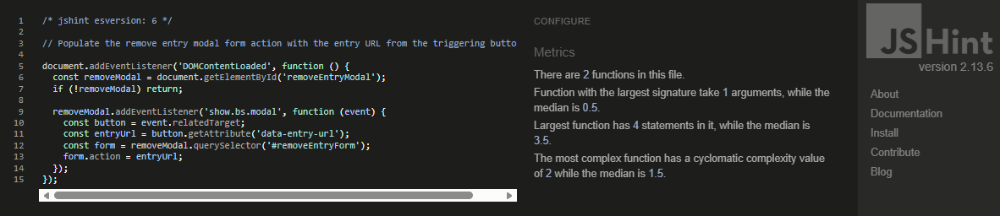 | None. |
| spinner.js | ✅ | 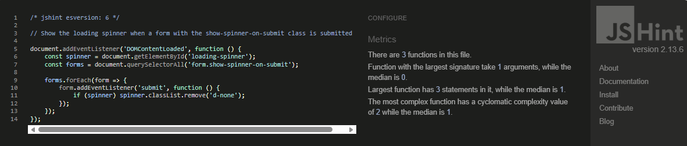 | None. |

### Python Linter
All Python files validated using [PEP8 Code Institute Python Linter](https://pep8ci.herokuapp.com/) to ensure comprehensive code quality and PEP8 compliance.

Quality assurance:
- Docstrings
- Import organization: Django imports → third-party → local imports
- Line length: 79 characters

| App | File | URL | Status | Notes |
|----|----|----|----|----|
| core | admin.py | [Pep8 CI Link](https://pep8ci.herokuapp.com/https://raw.githubusercontent.com/louisfjames/gamecodex/refs/heads/main/core/admin.py) | ✅ | None. |
| core | apps.py | [Pep8 CI Link](https://pep8ci.herokuapp.com/https://raw.githubusercontent.com/louisfjames/gamecodex/refs/heads/main/core/apps.py) | ✅ | None. |
| core | models.py | [Pep8 CI Link](https://pep8ci.herokuapp.com/https://raw.githubusercontent.com/louisfjames/gamecodex/refs/heads/main/core/models.py) | ✅ | None. |
| core | tests.py | [Pep8 CI Link](https://pep8ci.herokuapp.com/https://raw.githubusercontent.com/louisfjames/gamecodex/refs/heads/main/core/tests.py) | 🔶 | None. |
| core | views.py | [Pep8 CI Link](https://pep8ci.herokuapp.com/https://raw.githubusercontent.com/louisfjames/gamecodex/refs/heads/main/core/views.py) | ✅ | Fix to spacing required (4f67fd3) - now fixed. |
| games | admin.py | [Pep8 CI Link](https://pep8ci.herokuapp.com/https://raw.githubusercontent.com/louisfjames/gamecodex/refs/heads/main/games/admin.py) | ✅ | None. |
| games | apps.py | [Pep8 CI Link](https://pep8ci.herokuapp.com/https://raw.githubusercontent.com/louisfjames/gamecodex/refs/heads/main/games/apps.py) | ✅ | None. |
| games | models.py | [Pep8 CI Link](https://pep8ci.herokuapp.com/https://raw.githubusercontent.com/louisfjames/gamecodex/refs/heads/main/games/models.py) | ✅ | None. |
| games | tests.py | [Pep8 CI Link](https://pep8ci.herokuapp.com/https://raw.githubusercontent.com/louisfjames/gamecodex/refs/heads/main/games/tests.py) | 🔶 | None. |
| games | views.py | [Pep8 CI Link](https://pep8ci.herokuapp.com/https://raw.githubusercontent.com/louisfjames/gamecodex/refs/heads/main/games/views.py) | ✅ | Fix to spacing and line length required (c59c6b1) - now fixed.|
| games | igdb.py | [Pep8 CI Link](https://pep8ci.herokuapp.com/https://raw.githubusercontent.com/louisfjames/gamecodex/refs/heads/main/games/services/igdb.py) | ✅ | Fix to spacing required and line length (a250812) - now fixed. |
| profiles | admin.py | [Pep8 CI Link](https://pep8ci.herokuapp.com/https://raw.githubusercontent.com/louisfjames/gamecodex/refs/heads/main/profiles/admin.py) | ✅ | None. |
| profiles | apps.py | [Pep8 CI Link](https://pep8ci.herokuapp.com/https://raw.githubusercontent.com/louisfjames/gamecodex/refs/heads/main/profiles/apps.py) | ✅ | None. |
| profiles | forms.py | [Pep8 CI Link](https://pep8ci.herokuapp.com/https://raw.githubusercontent.com/louisfjames/gamecodex/refs/heads/main/profiles/forms.py) | ✅ | Fix to spacing required and line length (4890df9) - now fixed.  |
| profiles | models.py | [Pep8 CI Link](https://pep8ci.herokuapp.com/https://raw.githubusercontent.com/louisfjames/gamecodex/refs/heads/main/profiles/models.py) | ✅ | Fix to spacing required (f99058e) - now fixed. |
| profiles | tests.py | [Pep8 CI Link](https://pep8ci.herokuapp.com/https://raw.githubusercontent.com/louisfjames/gamecodex/refs/heads/main/profiles/tests.py) | 🔶 | None. |
| profiles | urls.py | [Pep8 CI Link](https://pep8ci.herokuapp.com/https://raw.githubusercontent.com/louisfjames/gamecodex/refs/heads/main/profiles/urls.py) | ✅ | None. |
| profiles | views.py | [Pep8 CI Link](#) | ✅ | None.|
| gamecodex | asgi.py | [Pep8 CI Link](#) | ✅ | None.|
| gamecodex | settings.py | [Pep8 CI Link](#) | ✅ | None.|
| gamecodex | urls.py | [Pep8 CI Link](#) | ✅ | None.|
| gamecodex | wsgi.py | [Pep8 CI Link](#) | ✅ | None.|

MUST UPDATE THIS AFTER THE AUTOMATED TESTING IN DJANGO IS COMPLETE

| app | #.py | [Pep8 CI Link](#) | # | None. |

### Automated Testing (Django)
Automated testing checks code behaviour by running tests through a tool or script rather than by hand. Its key principles are repeatability, consistency, and early detection of errors. Automated tests run the same steps every time, which removes human error and makes it easier to spot issues when new features are added. They are useful for checking functions, input handling, and any part of the code that should always behave in the same way. 

Automated testing to be added here.

### Google Chrome Lighthouse

| Page | Desktop Results| Notes |
|------|---------------|------|
| Landing Page | 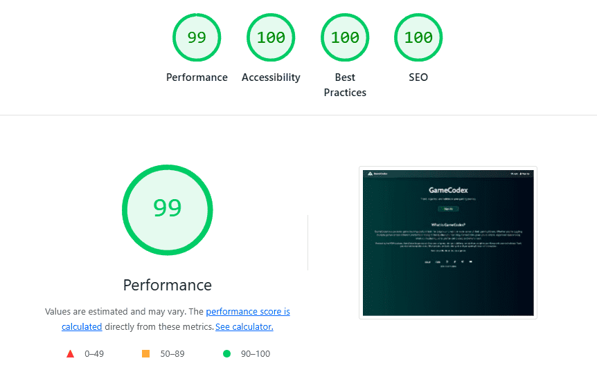| None. |
| Signup Page | 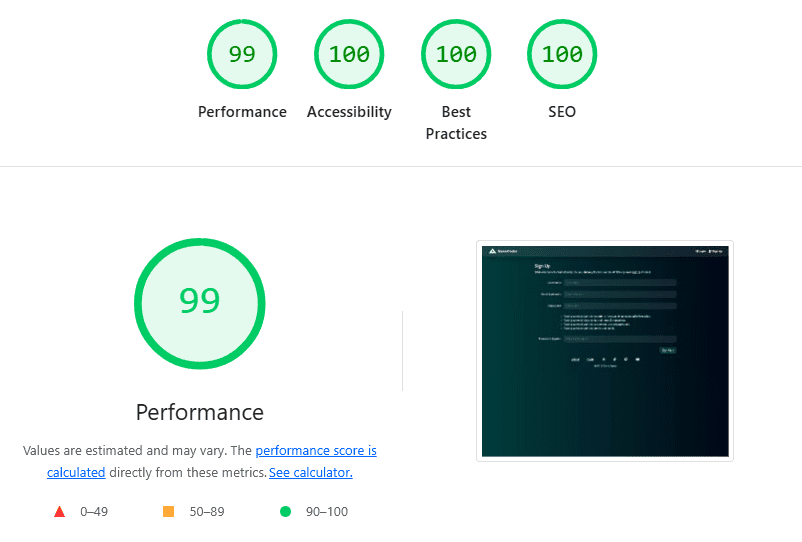 | None. | 
| Login Page | 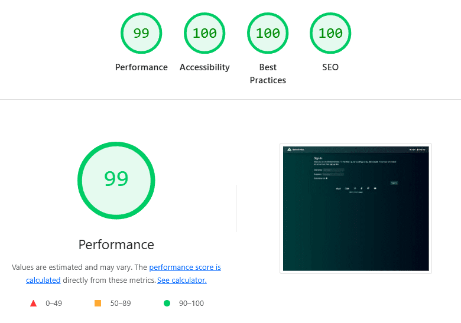 | None. |
| Profile Page | 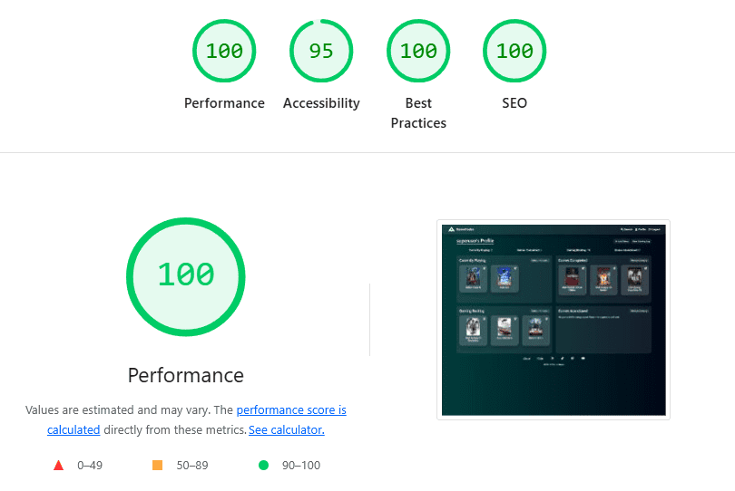 | None. |
| Search Page | 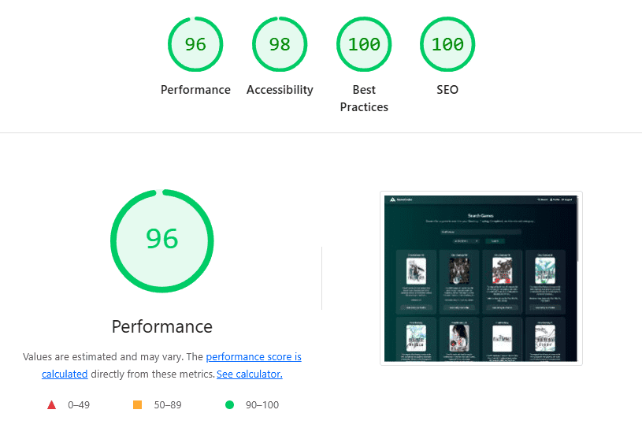 | Added aria label to dropdown to improve accessibility. See commit - 03d1da7. |
| Add Game Page | 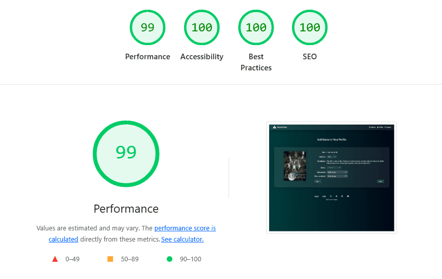 | Added aria labels to form elements to improve accessibility. See commit - 03d1da7.  |
| Edit Game Page | 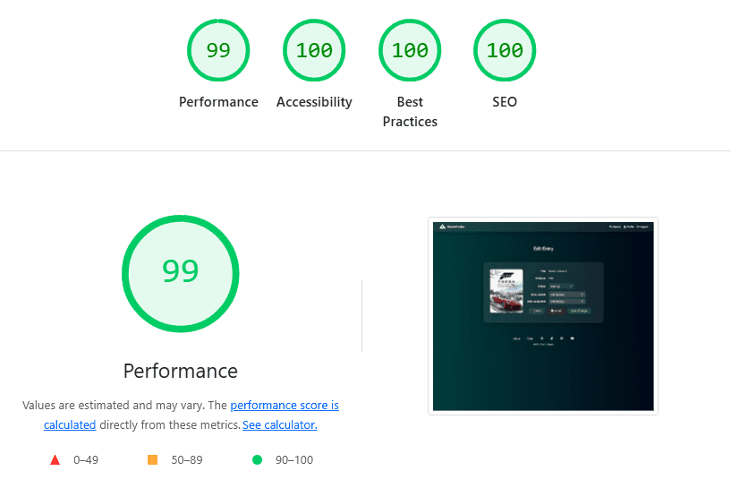 | Added aria labels to form elements to improve accessibility. See commit - 03d1da7.  |
| All Entries / Gaming Log Page | 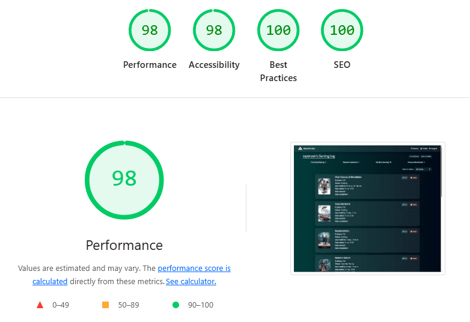 | None. |

### Bug Fixes
This section documents the issues found during development and how each one was resolved. It provides a clear record of problems and fixes highlighted during manual testing.

<table>
  <thead>
    <tr>
      <th>Bug Title</th>
      <th>Bug Description</th>
      <th>Fixed?</th>
      <th>Fixed Description</th>
      <th>GitHub Commit Reference</th>
    </tr>
  </thead>
  <tbody>
    <tr>
      <td>(1) Fourth backlog entry not visible</td>
      <td>Adding a fourth game causes it not to appear on the profile page, despite being saved in the database.</td>
      <td>✅ PASS</td>
      <td>Fix: Ensure backlog entries are ordered by -date_modified so the three most recently updated items appear on the profile page. All entries remain accessible on the full backlog page. This resolves the issue where older items pushed newer ones out of the visible slice.</td>
      <td>deaa770</td>
    </tr>
    <tr>
      <td>(2) Backlog ordering incorrect</td>
      <td>Games added to the backlog display oldest first instead of newest first. Expected newest entries to appear on the left.</td>
      <td>✅ PASS</td>
      <td>Fix: Update backlog queryset to order by -date_modified instead of date_added. This ensures the most recently edited backlog items appear first, matching expected behaviour.</td>
      <td>deaa770</td>
    </tr>
    <tr>
      <td>(3) All Entries page not showing newest items first</td>
      <td>Newly added games do not appear at the top of the All Entries page. Ordering is incorrect, showing older entries before newer ones.</td>
      <td>✅ PASS</td>
      <td>Fix: Update the All Entries queryset to order by -date_modified so the most recently updated games appear at the top. This aligns the All Entries page with the profile page ordering.</td>
      <td>deaa770</td>
    </tr>
  </tbody>
</table>

[*Back to contents*](#table-of-contents)